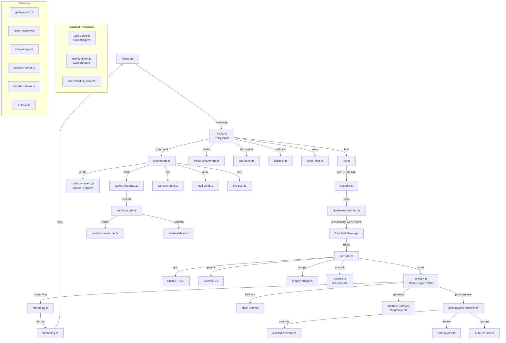

# JARVIS — Claude Telegram Bot

Control Claude Code (and more) from your phone via Telegram.
Built with **Bun + TypeScript + grammY** (~36,000 lines, 142 files).

---

## Architecture



### Message Flow

```
Telegram message → Handler → Auth check → Rate limit → Claude session → Streaming response → Audit log
```

---

## Setup

### 1. Prerequisites

- [Bun](https://bun.sh) v1.x
- macOS (LaunchAgents require macOS)
- Telegram bot token from [@BotFather](https://t.me/botfather)
- Claude Code CLI installed and authenticated (`claude` command available)

### 2. Install

```bash
git clone <repo>
cd claude-telegram-bot
bun install
```

### 3. Configure environment

```bash
cp .env.example .env
# Edit .env with your values
```

**Required:**

| Variable | Description |
|---|---|
| `TELEGRAM_BOT_TOKEN` | Bot token from BotFather |
| `TELEGRAM_ALLOWED_USERS` | Comma-separated Telegram user IDs |
| `CLAUDE_WORKING_DIR` | Working directory for Claude sessions |

**Recommended (warn on startup if missing):**

| Variable | Description |
|---|---|
| `GATEWAY_API_KEY` | Memory Gateway (Cloudflare D1) API key |
| `GAS_GMAIL_URL` | Google Apps Script Gmail web app URL |
| `MEMORY_GATEWAY_URL` | Gateway base URL (has default) |

**Finding your Telegram user ID:** Message [@userinfobot](https://t.me/userinfobot).

### 4. LaunchAgents (macOS)

```bash
# Main bot
cp launchd/com.claude-telegram-ts.plist ~/Library/LaunchAgents/
launchctl load ~/Library/LaunchAgents/com.claude-telegram-ts.plist

# Task poller (independent — survives bot restarts)
cp launchd/com.jarvis.task-poller.plist ~/Library/LaunchAgents/
launchctl load ~/Library/LaunchAgents/com.jarvis.task-poller.plist
```

**Logs:**
```bash
tail -f /tmp/claude-telegram-bot-ts.log
tail -f /tmp/claude-telegram-bot-ts.err
```

### 5. MCP Servers (optional)

```bash
cp mcp-config.ts mcp-config.local.ts
# Edit mcp-config.local.ts with your MCP servers
```

---

## Commands

### Session

| Command | Description |
|---|---|
| `/start` | Start or show session |
| `/new` | New Claude session |
| `/stop` | Stop current session |
| `/status` | Session status |
| `/resume` | Resume last session |
| `/restart` | Restart bot |
| `/retry` | Retry last message |
| `/why` | Explain last response |

### AI

| Command | Description |
|---|---|
| `/ai` | AI session bridge |
| `/code <task>` | Headless Claude Code (`claude -p`) |
| `/gpt <msg>` | Ask ChatGPT |
| `/gem <msg>` | Ask Gemini |
| `/debate <topic>` | 3-AI council debate |
| `/ask <query>` | Chrome-based query |

### Task Orchestrator

| Command | Description |
|---|---|
| `/task <desc>` | Create + run task |
| `/taskstop` | Stop running task |
| `/taskstatus` | Task queue status |
| `/tasklog` | Task execution log |
| `/task_start` / `/task_stop` / `/task_pause` | Task lifecycle |

### Business Shortcuts

| Command | Description |
|---|---|
| `/project <name>` | Open/create project |
| `/customer <name>` | Customer record |
| `/followup` | Log follow-up |
| `/expense [amount] [desc]` | Log expense |
| `/expense_report` | Generate expense report |
| `/note <text>` | Quick note → Obsidian |
| `/meeting [title]` | Start meeting notes |

### Productivity

| Command | Description |
|---|---|
| `/dashboard` | Morning dashboard |
| `/quick <text>` | Quick capture |
| `/morning` | Morning briefing |
| `/todo <text>` | Add todo |
| `/todos` | List todos |
| `/focus` | Toggle focus mode |
| `/alarm <time>` | Set alarm |
| `/reminder <text>` | Set reminder |
| `/recall <query>` | Search memories |
| `/memory` | Show memories |
| `/remember <text>` | Save memory |
| `/forget <text>` | Delete memory |

### Communication

| Command | Description |
|---|---|
| `/mail <text>` | Send email via GAS |
| `/imsg <text>` | Send iMessage |
| `/line <text>` | Post to LINE |
| `/lineschedule` | Schedule LINE post |
| `/cal` | Calendar operations |

### Claude.ai Integration

| Command | Description |
|---|---|
| `/chat [msg]` | Send to claude.ai tab |
| `/chats` | List claude.ai tabs |
| `/post <text>` | Post to claude.ai |
| `/findchat <q>` | Find claude.ai chat |
| `/askuuid <uuid>` | Ask specific chat UUID |
| `/newdomain <url>` | Register new domain |
| `/refresh` | Refresh context |

### System / Meta

| Command | Description |
|---|---|
| `/help` | Help |
| `/stats` | Bot statistics |
| `/perf` | Handler performance (top 10 avg/max ms) |
| `/audit` | Codebase audit |
| `/spec <text>` | Write spec |
| `/decide <text>` | Log decision |
| `/decisions` | List decisions |
| `/scout [N]` | Scout codebase |
| `/search <query>` | Web search |
| `/manual <cmd>` | Run manual command |
| `/croppy [enable\|disable\|status]` | Auto-approval mode |
| `/todoist` | Todoist sync |
| `/timetimer [min]` | Time timer |
| `/jarvisnotif` | JARVIS notifications |
| `/bridge` / `/workers` | Croppy bridge |

---

## Project Structure

```
src/
├── index.ts              # Entry point, handler registration, polling
├── config.ts             # Env vars, constants, safety prompt, validation
├── session.ts            # ClaudeSession — Agent SDK streaming
├── security.ts           # RateLimiter, path validation, command safety
├── formatting.ts         # Markdown → HTML for Telegram
│
├── handlers/             # 41 handler files
│   ├── text.ts           # Message routing pipeline
│   ├── streaming.ts      # Status callbacks, streaming state
│   ├── media-commands.ts # FLUX/ComfyUI image generation
│   ├── council.ts        # /debate 3-AI system
│   ├── ai-router.ts      # AI provider routing
│   ├── claude-chat.ts    # claude.ai Internal API
│   ├── inbox.ts          # Inbox Zero actions
│   ├── callback.ts       # Inline button callbacks
│   └── ...
│
├── task/                 # Task orchestrator
│   ├── orchestrate.ts    # Core orchestration
│   ├── executor.ts       # Safe command execution
│   └── validator.ts      # Banned patterns + tests
│
├── services/             # Background services
│   ├── gateway-db.ts     # D1 queries via Memory Gateway
│   ├── jarvis-memory.ts  # Vector memory
│   ├── inbox-triage.ts   # Inbox Zero polling
│   └── snooze.ts         # Snooze re-notification
│
├── utils/
│   ├── logger.ts         # Structured JSON line logger
│   ├── rate-limiter.ts   # Token bucket (Telegram 30/min, Gateway 10/min)
│   ├── retry.ts          # Exponential backoff retry
│   ├── perf-tracker.ts   # Handler timing (avg/max ms)
│   ├── telegram-buffer.ts # High-load message buffer middleware
│   ├── circuit-breaker.ts # Circuit breaker for Gateway
│   └── fetch-with-timeout.ts
│
└── bin/                  # Independent LaunchAgent processes
    ├── task-poller.ts    # Task queue poller
    ├── nightly-agent.ts  # Nightly batch agent
    └── line-schedule-poller.ts
```

---

## Development

```bash
bun run start      # Run bot
bun run dev        # Auto-reload (--watch)
bun test           # Run all tests
bun run typecheck  # TypeScript check
bun install        # Install deps
```

### Git hooks

Husky pre-commit runs:
1. BANNED keyword check — blocks API key literals and SDK direct imports
2. `bun test` — all tests must pass before commit

Use `--no-verify` only for automated Layer 2 commits.

### Bot restart

Always use the restart script to prevent 409 Conflict:

```bash
bash scripts/restart-bot.sh
```

### Adding a command

1. Create handler function
2. Register in `src/index.ts`: `bot.command("name", handler)`

---

## Security

6-layer defence in depth:

1. **Allowlist** — only configured Telegram user IDs
2. **Rate limit** — token bucket per user (20 req / 60s)
3. **Path validation** — file ops restricted to `ALLOWED_PATHS`
4. **Command safety** — blocks `rm -rf`, fork bombs, etc.
5. **git pre-commit** — BANNED keyword check blocks API keys
6. **Hookify** — SDK import + API key write blocking (local `.claude/hookify.*.local.md`)

**AI calls are CLI-only** — no paid API keys (`ANTHROPIC_API_KEY` / `OPENAI_API_KEY` / `GEMINI_API_KEY`) are used directly.

---

## Runtime Files

| Path | Purpose |
|---|---|
| `/tmp/claude-telegram-session.json` | Active session state |
| `/tmp/claude-telegram-audit.log` | Audit log |
| `/tmp/telegram-bot/` | Temporary media files |
| `/tmp/jarvis-bot.pid` | PID lock (409 prevention) |
| `~/.jarvis/orchestrator/message-queue.json` | Chrome inject retry queue |

---

## License

MIT
