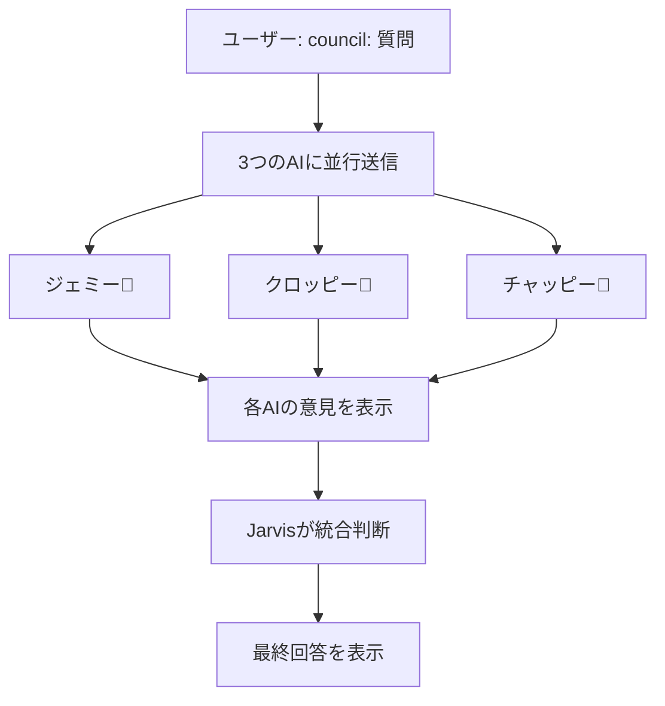

# AI Council - 実装ドキュメント

## 概要

AI Councilは、3つのAIアドバイザー（Gemini、Claude、ChatGPT）に同時に諮問し、Jarvisが最終的な統合判断を下す機能です。

## 使い方

```
council: 質問内容
```

例:
```
council: Pythonで機械学習を始めるには何から学ぶべき？
```

## 動作フロー



## 実装詳細

### 1. プレフィックス追加

`ai-router.ts` に `council:` プレフィックスを追加：

```typescript
export type AIProvider = 'jarvis' | 'gpt' | 'gemini' | 'croppy' | 'all' | 'council';
```

### 2. AI Council関数

```typescript
export async function callAICouncil(
  prompt: string,
  memoryPack: string
): Promise<Omit<AICouncilResponse, 'provider'>>
```

- 3つのAIに並行でリクエスト送信
- 各AIの応答を統合してフォーマット
- アドバイザーの意見を返す

### 3. 統合判断（Jarvis）

`text.ts` の `handleAIRouterRequest` で処理：

1. アドバイザーの意見を表示
2. Jarvisセッションに統合判断用プロンプトを送信
3. Jarvisが最終的な回答を生成

## コード例

### ai-router.ts

```typescript
case 'council':
  const councilResult = await callAICouncil(prompt, memoryPack);
  return {
    provider: 'council',
    ...councilResult,
  };
```

### text.ts

```typescript
if (provider === 'council' && 'advisorResponses' in response) {
  // 1. アドバイザーの意見を送信
  await sendLongMessage(ctx, response.advisorResponses);

  // 2. Jarvisが統合判断
  const councilPrompt = `あなたはJarvis🤖です。以下の3人のAIアドバイザーの意見を総合的に判断し、最良の回答を提供してください。

## ユーザーの質問
${prompt}

${response.advisorResponses}

---

上記の3人の意見を踏まえて、あなた（Jarvis）の最終判断を提示してください。`;

  // 3. Jarvisセッションに送信
  const jarvisResponse = await session.sendMessageStreaming(
    councilPrompt,
    username,
    userId,
    statusCallback,
    ctx.chat!.id,
    ctx
  );
}
```

## 利点

1. **多様な視点** - 3つの異なるAIモデルの意見を統合
2. **バランスの取れた回答** - 偏った意見を排除し、バランスを保つ
3. **透明性** - 各AIの意見が明示され、最終判断のプロセスが可視化される
4. **高品質** - 複数の意見を検討することで、より洗練された回答が得られる

## 注意事項

- AI Council は3つのAIに並行でリクエストするため、通常より時間がかかります（約30-60秒）
- 各AIの応答が長い場合、Telegramの文字数制限により分割送信されます
- Memory Gateway経由でAI_MEMORYが共有されます

## 実装日

2026-02-02

## 実装者

Jarvis🤖 (Claude Opus 4.5)
