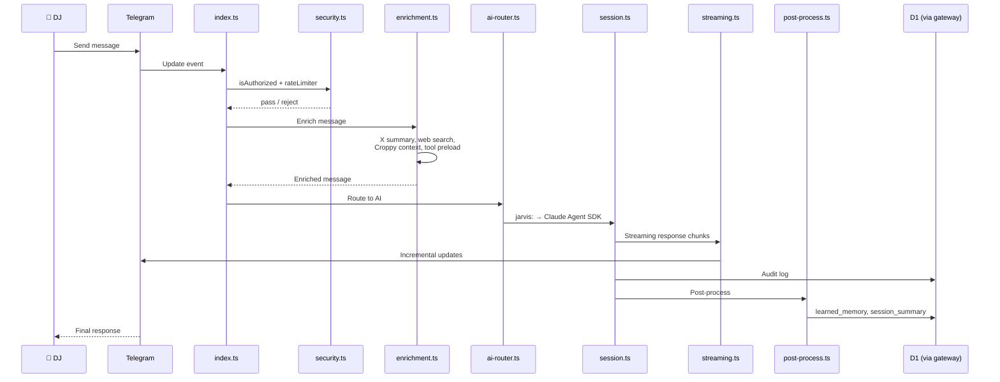
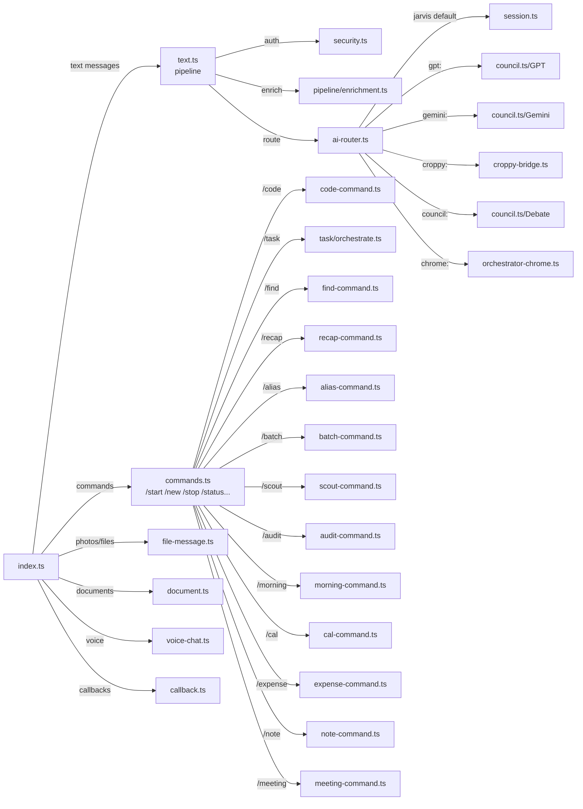
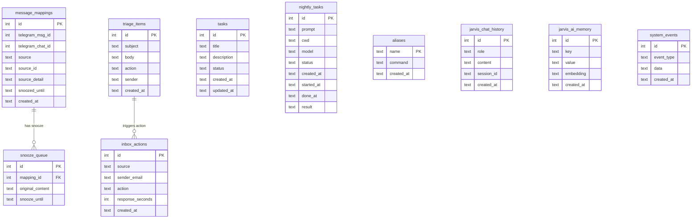
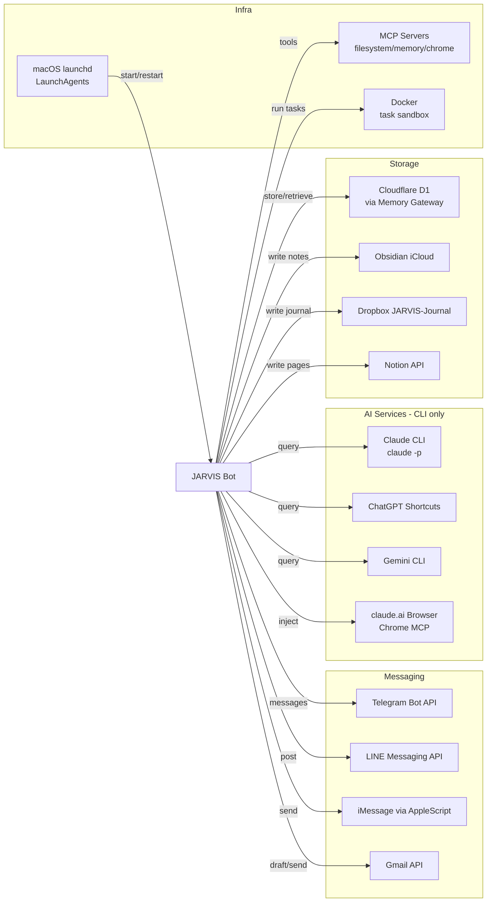
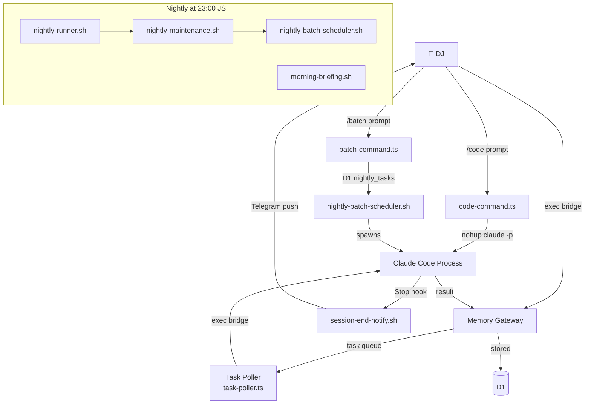

# JARVIS Architecture

**Updated:** 2026-04-05
**Source:** Expanded from codebase-audit-2026-04-04.md

---

## 1. System Overview

```mermaid
graph TD
    DJ[📱 DJ iPhone/Mac]
    TG[Telegram API]
    BOT[JARVIS Bot<br>src/index.ts]

    DJ -->|Telegram message| TG
    TG -->|webhook/polling| BOT

    BOT -->|AI queries| CLAUDE[Claude CLI<br>claude -p]
    BOT -->|AI queries| GPT[ChatGPT<br>Shortcuts CLI]
    BOT -->|AI queries| GEM[Gemini CLI]

    BOT -->|HTTP| GW[Memory Gateway<br>Cloudflare Worker]
    GW -->|D1 SQL| D1[(Cloudflare D1<br>Database)]

    BOT -->|write| OBS[Obsidian<br>iCloud Vault]
    BOT -->|write| DBX[Dropbox<br>JARVIS-Journal/]

    BOT -->|send| LINE[LINE API]
    BOT -->|send| GMAIL[Gmail API]
    BOT -->|spawn| CC[Claude Code<br>claude-code-spawn.sh]

    CC -->|result| BOT
    BOT -->|notify| TG

    subgraph M1_Mac [M1 Mac (mothership)]
        BOT
        CLAUDE
        GPT
        GEM
        POLL[Task Poller<br>com.jarvis.task-poller]
        NIGHT[Nightly Agent<br>nightly-agent.ts]
        LSCHED[LINE Schedule<br>line-schedule-poller.ts]
        CHROME[Chrome Browser<br>claude.ai tabs]
    end

    subgraph Cloudflare [Cloudflare Edge]
        GW
        D1
    end

    subgraph External [External Services]
        LINE
        GMAIL
        OBS
        DBX
        NOTION[Notion API]
    end

    POLL -->|exec bridge| CC
    NIGHT -->|claude -p| CLAUDE
```

---

## 2. Message Flow



---

## 3. Handler Architecture



---

## 4. Data Flow (D1 Tables)



---

## 5. External Services Map



---

## 6. Autonomous Execution Pipeline


