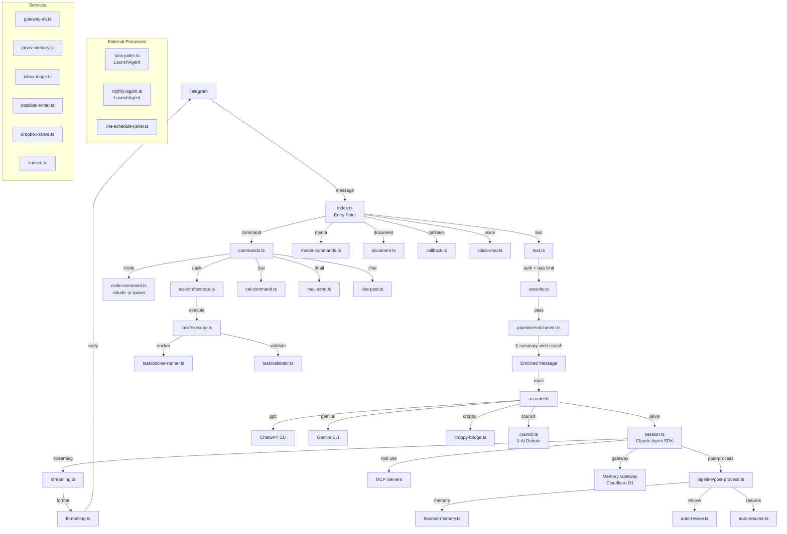

# JARVIS Codebase Audit Report

**Date:** 2026-04-04
**Auditor:** Claude Code (Opus 4.6)
**Repo:** claude-telegram-bot (main branch, commit 466fb7d)

---

## 1. Architecture Overview

### System Diagram

### Entry Points

| Entry Point | Type | Purpose |
|---|---|---|
| `src/index.ts` (448 lines) | Main | Bot startup, handler registration, polling |
| `src/bin/task-poller.ts` | LaunchAgent | Independent task queue poller |
| `src/bin/nightly-agent.ts` | LaunchAgent | Nightly batch execution |
| `src/bin/line-schedule-poller.ts` | LaunchAgent | LINE schedule event poller |

### Counts

| Metric | Count |
|--------|-------|
| Source files (.ts, excl. tests) | 111 |
| Lines of TypeScript (excl. tests) | 28,533 |
| Test files (.test.ts) | 39 |
| Handler files (src/handlers/) | 42 |
| Service files (src/services/) | 8 |
| Scripts (scripts/) | 92 |

---

## 2. Code Health

### Files Over 300 Lines (Complexity Risk)

| File | Lines | Concern |
|------|-------|---------|
| `src/handlers/commands.ts` | 1,236 | God file: 17+ command handlers |
| `src/handlers/media-commands.ts` | 1,127 | Image/video gen + queue management |
| `src/handlers/inbox.ts` | 980 | Batch queue + 20+ callback types |
| `src/handlers/orchestrator-chrome.ts` | 848 | Chrome routing + handoff logic |
| `src/services/inbox-triage.ts` | 800 | Multi-stage triage classification |
| `src/session.ts` | 782 | Claude SDK + streaming + tool safety |
| `src/handlers/ai-router.ts` | 747 | Multi-AI routing + fallbacks |
| `src/handlers/text.ts` | 694 | Text pipeline + domain routing |
| `src/handlers/document.ts` | 682 | Document processing |
| `src/task/orchestrate.ts` | 640 | Task orchestration + git worktree |
| `src/task/validator.ts` | 549 | Banned patterns + validation |
| `src/handlers/council.ts` | 543 | 3-AI debate logic |
| `src/handlers/claude-chat.ts` | 518 | Claude.ai integration |

### Functions Over 50 Lines (Refactor Candidates)

| File | Function | Est. Lines | Issue |
|------|----------|-----------|-------|
| `src/session.ts` | response processing block | ~100 | Tool validation with 4-5 nesting levels |
| `src/handlers/inbox.ts` | `handleInboxCallback()` | ~150 | Switch with 20+ cases |
| `src/handlers/inbox.ts` | `executeBatch()` | ~74 | Nested snooze logic |
| `src/handlers/orchestrator-chrome.ts` | `checkAndHandoff()` | ~130 | Token est. + summary + context |
| `src/handlers/orchestrator-chrome.ts` | `route()` | ~100 | Project lock + routing decision |
| `src/handlers/commands.ts` | `handleStatus()` | ~73 | Complex status aggregation |

### Cyclomatic Complexity Hotspots

1. **`src/session.ts` (lines 480-580)** - 4-5 nesting levels: tool type check > tool name check > safety check > path validation > retry loop
2. **`src/handlers/inbox.ts` (lines 80-114)** - 4-5 levels: switch > case > try/catch > if/else with IIFE
3. **`src/handlers/text.ts` (lines 230-310)** - 3-4 levels: message length > chunk loop > route tag check
4. **`src/handlers/orchestrator-chrome.ts` (lines 700-750)** - 3-4 levels: project check > handoff > emergency fallback

### TypeScript Errors

**tsc --noEmit: CLEAN** - Zero errors.

### Duplicate Code Patterns

| Pattern | Occurrences | Files |
|---------|-------------|-------|
| `JSON.parse(readFileSync(path, "utf-8"))` | 16+ | commands, index, croppy-bridge, code-command, domain-buffer, orchestrate, etc. |
| Todoist API `fetch("https://api.todoist.com/...")` | 2 | commands.ts, inbox.ts |
| HTTP error handling (fetch + status check) | 10+ | Multiple handlers |

---

## 3. Test Coverage Gaps

### Handler Coverage: 4/42 (9.5%)

#### Tested Handlers
- `ai-router.test.ts`
- `callback.test.ts`
- `code-command.test.ts`
- `commands.test.ts`

#### Untested Handlers by Priority

**HIGH (core message flow, security, destructive ops):**

| Handler | Why Critical |
|---------|-------------|
| `text.ts` | Entry point for 90% of messages |
| `claude-chat.ts` | Main Claude integration, subprocess |
| `claude-chat-api.ts` | API layer for Claude interactions |
| `voice-chat.ts` | Complex STT/TTS pipeline |
| `ai-session.ts` | Session lifecycle management |
| `domain-router.ts` | Subprocess execution, routing |
| `inbox.ts` | Destructive ops (archive/delete), batch queue |
| `streaming.ts` | Streaming response handling |

**MEDIUM:**

| Handler | Why |
|---------|-----|
| `council.ts` | Multi-AI consensus logic |
| `orchestrator-chrome.ts` | Browser automation |
| `croppy-bridge.ts` | Browser tab management |
| `media-commands.ts` | Image/video generation |
| `memory-commands.ts` | Memory CRUD |
| `search-command.ts` | Search integration |
| `agent-task.ts` | Agent SDK wrapper |
| `document.ts` | File processing |

**LOW (simple forwarding/command):**
cal-command, audit-command, ask-command, mail-send, imsg-send, line-post, line-schedule, jarvisnotif-command, timetimer-command, manual-command, refresh-command, scout-command, deadline-input, croppy-commands, media-group, file-message, why

### Service Coverage: 0/8 (0%)

| Service | Priority |
|---------|----------|
| `gateway-db.ts` | **HIGH** - D1 database access |
| `jarvis-memory.ts` | **HIGH** - Vector DB + memory |
| `inbox-triage.ts` | **HIGH** - External API + destructive ops |
| `memory-extractor.ts` | **MEDIUM** |
| `obsidian-writer.ts` | **MEDIUM** |
| `dropbox-share.ts` | **MEDIUM** |
| `domain-buffer.ts` | **LOW-MEDIUM** |
| `snooze.ts` | **LOW** |

### Test Summary

| Area | Files | Tested | Coverage |
|------|-------|--------|----------|
| Handlers | 42 | 4 | 9.5% |
| Services | 8 | 0 | 0% |
| Task | 10 | 9 | 90% |
| Utils | 20+ | 25 tests | ~60% |
| **Total test files** | — | **39** | — |

---

## 4. Dependency Audit

### Vulnerability Scan

`bun audit` not available. Manual review performed.

### Dependencies

| Package | Version | Status |
|---------|---------|--------|
| `@anthropic-ai/claude-agent-sdk` | ^0.1.76 | Used, current |
| `@grammyjs/runner` | ^2.0.3 | Used |
| `@modelcontextprotocol/sdk` | ^1.25.1 | Used |
| `better-sqlite3` | ^12.6.2 | Used |
| `grammy` | ^1.38.4 | Used |
| `ulidx` | ^2.4.1 | Used |
| `zod` | ^4.2.1 | Used |
| **`docx`** | **^9.6.0** | **UNUSED - no imports found** |
| **`ulid`** | **^3.0.2** | **UNUSED - ulidx is used instead** |

### Missing @types

| Package | Reason |
|---------|--------|
| `@types/node` | Used extensively (child_process, fs, path, os) but relies on `@types/bun` |

### Unused Dependencies

1. **`docx` (^9.6.0)** - Zero imports in src/
2. **`ulid` (^3.0.2)** - Superseded by `ulidx`

---

## 5. Security Scan

### Hardcoded Secrets

**NONE FOUND** - All tokens sourced from `process.env.*`. Redaction filter (`src/utils/redaction-filter.ts`) covers API keys, Bearer tokens, JWTs, private keys, emails, credit cards.

### SQL Injection

**SAFE** - All SQLite queries in `control-tower-db.ts` use parameterized `.prepare()` statements.

### Shell Injection Risks

| File | Line | Severity | Issue |
|------|------|----------|-------|
| `src/utils/tool-preloader.ts` | 33 | **HIGH** | `execSync(\`find ... -name "${ref.split('/').pop()}"\`)` - unvalidated filename in shell command |
| `src/task/docker-runner.ts` | 57, 81 | LOW | `DOCKER_IMAGE` is constant (safe), but pattern is fragile |

### Empty API Key Risk

| File | Issue |
|------|-------|
| `src/handlers/ai-router.ts:57` | `GATEWAY_API_KEY = process.env.GATEWAY_API_KEY \|\| ''` - empty string allows unauthenticated API calls |

### .env Validation

- `.env.example` EXISTS
- `config.ts` validates required vars (`TELEGRAM_BOT_TOKEN`, `TELEGRAM_ALLOWED_USERS`) with `process.exit(1)` on missing
- 6-layer security model verified: Allowlist > Rate limit > Path validation > Command safety > git pre-commit > Hookify

---

## 6. Performance Concerns

### Synchronous I/O (Event Loop Blocking)

**150+ occurrences of readFileSync/writeFileSync/execSync/spawnSync**

**Worst offenders:**

| File | Sync Calls | Impact |
|------|-----------|--------|
| `src/handlers/orchestrator-chrome.ts` | 17 | readFileSync + execSync for Chrome ops |
| `src/services/domain-buffer.ts` | 15 | readFileSync + execSync with 5-10s timeouts |
| `src/task/orchestrate.ts` | 15+ | execSync for git worktree operations |
| `src/handlers/commands.ts` | 10 | readFileSync for config/stats |
| `src/services/obsidian-writer.ts` | 7 | readFileSync + writeFileSync for vault |
| `src/handlers/media-commands.ts` | 6 | spawnSync for sips, readFileSync for config |
| `src/index.ts` | 5 | readFileSync at startup (acceptable) |

### Missing Timeouts on External API Calls

**14+ fetch() calls without AbortController/timeout:**

| File | Line | Target |
|------|------|--------|
| `src/services/dropbox-share.ts` | 25 | Dropbox file download |
| `src/services/inbox-triage.ts` | 294, 455 | External API |
| `src/handlers/media-commands.ts` | 285 | Image URL fetch |
| `src/handlers/voice-chat.ts` | 54 | Voice file download |
| `src/handlers/inbox.ts` | 68, 332, 367, 389 | Gateway API |
| `src/handlers/memory-commands.ts` | 67 | localhost:19823 |
| `src/utils/tg-file.ts` | 50 | Telegram file API |
| `src/handlers/task-command.ts` | 36 | Task API |
| `src/bin/line-schedule-poller.ts` | 35 | LINE API |

### Memory Leak Risks (Unbounded Global Collections)

| File | Line | Collection | Cleanup? |
|------|------|-----------|----------|
| `orchestrator-chrome.ts` | 31 | `projectInjectCounts: Map` | No |
| `croppy-bridge.ts` | 33 | `lockedWorkers: Set` | No |
| `croppy-bridge.ts` | 98 | `workerInjectCounts: Map` | No |
| `croppy-bridge.ts` | 29 | `bridgeReplyMap: Map` | Yes (FIFO at 100) |

---

## 7. Tech Debt Inventory

### TODO/FIXME Comments

| File | Line | Comment |
|------|------|---------|
| `src/services/inbox-triage.ts` | 788 | `// TODO: Actually send the reply via LINE/Gmail` |
| `src/handlers/croppy-bridge.ts` | 276 | `// TODO: implement task queue` |

### Inconsistent Patterns

| Pattern | Occurrences | Issue |
|---------|-------------|-------|
| `.then()/.catch()` mixed with async/await | 82+ | Inconsistent error handling |
| `require()` in ES module files | 3 | domain-buffer.ts, croppy-bridge.ts |
| `process.env.*` direct access | 144 locations (55 files) | Not centralized through config.ts |

### Scattered Configuration

Constants defined locally instead of in `config.ts`:
- `media-commands.ts:39-44` - AI_MEDIA_SCRIPT, PYTHON, TIMEOUT_IMAGE, TIMEOUT_VIDEO
- `jarvis-memory.ts:19-21` - EMBED_SERVER, EMBED_TIMEOUT
- `croppy-bridge.ts:20-22` - Script paths
- `orchestrator-chrome.ts:22-27` - Script paths, directories
- `memory-gc.ts:24-28` - GC thresholds

---

## 8. Improvement Roadmap

### Priority Matrix

| # | Finding | Impact | Effort | Priority |
|---|---------|--------|--------|----------|
| 1 | Fix shell injection in tool-preloader.ts:33 | HIGH | SMALL | **P0** |
| 2 | Add timeouts to 14 fetch() calls | HIGH | SMALL | **P0** |
| 3 | Remove unused deps (docx, ulid) | LOW | SMALL | **P1** |
| 4 | Validate GATEWAY_API_KEY is non-empty | MED | SMALL | **P1** |
| 5 | Add cleanup/eviction to 3 global Maps | MED | SMALL | **P1** |
| 6 | Add tests for gateway-db.ts | HIGH | MED | **P1** |
| 7 | Add tests for text.ts | HIGH | MED | **P1** |
| 8 | Add tests for inbox.ts | HIGH | MED | **P1** |
| 9 | Add tests for voice-chat.ts | HIGH | MED | **P1** |
| 10 | Add tests for claude-chat.ts | HIGH | MED | **P2** |
| 11 | Add tests for jarvis-memory.ts | HIGH | MED | **P2** |
| 12 | Add tests for inbox-triage.ts | HIGH | MED | **P2** |
| 13 | Extract JSON config loader utility | MED | SMALL | **P2** |
| 14 | Centralize scattered constants into config.ts | MED | MED | **P2** |
| 15 | Croppy-bridge TODO: implement task queue | MED | MED | **P2** |
| 16 | Inbox-triage TODO: LINE/Gmail reply | MED | MED | **P2** |
| 17 | Split commands.ts (1236 lines) | MED | LARGE | **P3** |
| 18 | Split inbox.ts handleInboxCallback (150 lines) | MED | MED | **P3** |
| 19 | Reduce session.ts nesting (tool validation) | MED | MED | **P3** |
| 20 | Convert sync I/O to async (150+ calls) | MED | LARGE | **P3** |
| 21 | Normalize .then()/.catch() to async/await | LOW | LARGE | **P4** |
| 22 | Replace require() with ES imports | LOW | SMALL | **P4** |

### Summary Stats

| Metric | Value |
|--------|-------|
| Total findings | 22 |
| P0 (fix now) | 2 |
| P1 (this sprint) | 7 |
| P2 (next sprint) | 6 |
| P3 (backlog) | 4 |
| P4 (nice-to-have) | 3 |
| Security issues | 2 (1 HIGH, 1 MED) |
| Test coverage (handlers) | 9.5% |
| Test coverage (services) | 0% |
| Unused dependencies | 2 |
| Sync I/O hotspots | 150+ |
| Missing API timeouts | 14+ |
| Memory leak risks | 3 |

---

*End of audit report.*
